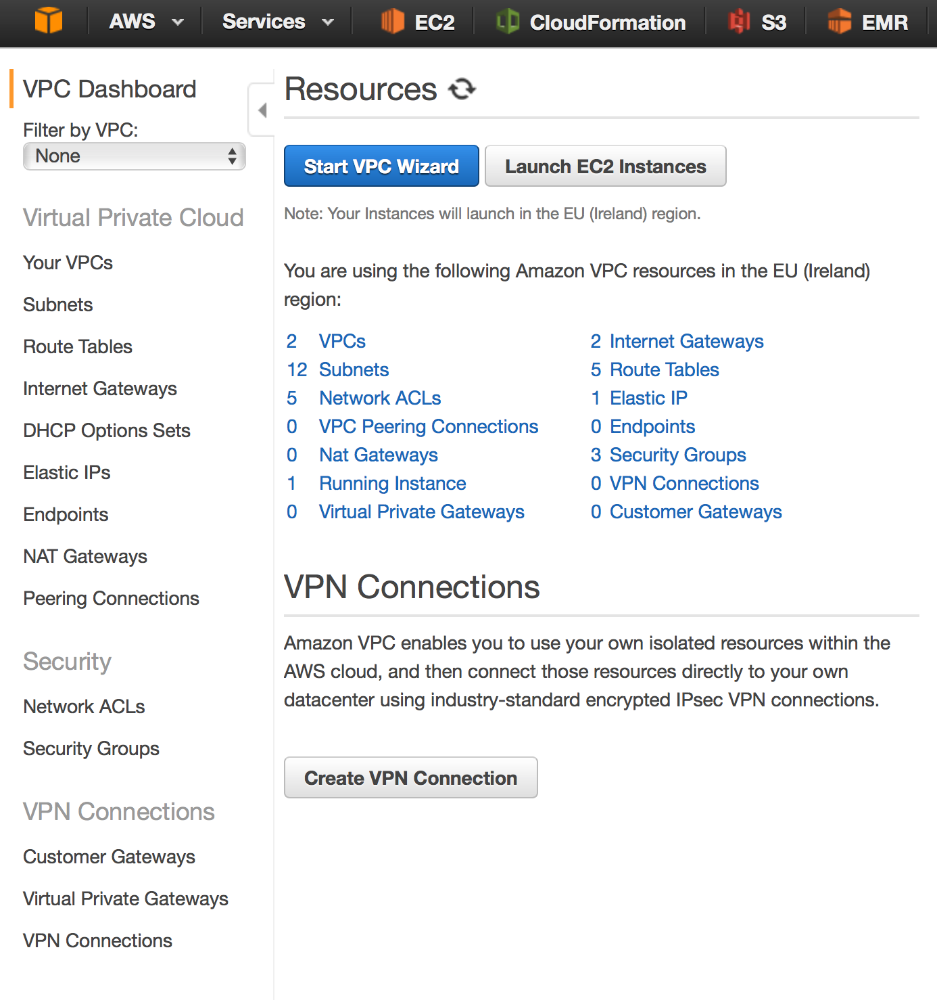

http://docs.aws.amazon.com/ElasticMapReduce/latest/ManagementGuide/emr-plan-vpc-subnet.html

# Overview

In this guide you will learn:

* How to use Amazon managed services to build a data lake.
* How to remotely access the data lake.
* How to run and monitor jobs in the data lake.

We assume you will provision all resources in the EU Ireland data center. Shorthand for this is 'eu-west-1'.

# Provisioning a data lake using EMR

We will go through all the steps of setting up a data lake in AWS. The managed service we will use is Amazon Elastic MapReduce (EMR). This service allows you to automatically provision a Hadoop/Spark Cluster, and run jobs on it through the Amazon console.
The benefit of this is that you do not have to configure all the components and applications in the Hadoop eco-system yourself. Amazon will do this for you. In addition, Amazon provides APIs and a web interface to access the cluster intead of you having to dig into the details of Hadoop.

### Create VPC
By default, an EMR cluster is created in a public subnet that is internet-facing. This means that only one firewall mistake may lead to giving out access to the public Internet.
In this guide we will configure the cluster in a private subnet, which is way more secure, and recommended when processing confidential data. Private subnets are not directly internet-facing, and can only be accessed from The Internet if the traffic is routed through an intermediate instance (e.g. load balancer/software vpn) in a public subnet. Instances in a private subnet cannot access any resources on The Internet, unless they are using a NAT or other outgoing proxy instance in a public subnet. This concept is similar to how your home router works (e.g. everybody behind the NAT will show as the same IP on The Internet).

In order to host an EMR cluster in a private subnet, we will first create a Virtual Private Cloud (VPC) environment which encapsulates all the resources you will provision in the remaining of the guide.
This is an isolated environment that allows you to run different Amazon services without interfering with other users.

From the AWS Console select "VPC", and start the VPC Wizard.

* Public Subnet
* Private Subnet
* ACLs

### Configure EMR
* Instance size
* Applications
* Security groups

# Remote Access to the Cluster

* OpenVPN
* ELB/proxy alternative

# Running an example job

### EMR console

### Scaling up/down

### Troubleshooting

# Running your custom job

