# Overview

In this guide you will learn:

* How to use Amazon managed services to build a data lake.
* How to remotely access the data lake.
* How to run and monitor jobs in the data lake.

**We assume you will provision all resources in the EU Ireland data center. Shorthand for this is 'eu-west-1'**.

# Provisioning a data lake using EMR

We will go through all the steps of setting up a data lake in AWS. The managed service we will use is Amazon Elastic MapReduce (EMR). This service allows you to automatically provision a Hadoop/Spark Cluster, and run jobs on it through the Amazon console.
The benefit of this is that you do not have to configure all the components and applications in the Hadoop eco-system yourself. Amazon will do this for you. In addition, Amazon provides APIs and a web interface to access the cluster intead of you having to dig into the details of Hadoop.

### Create Key Pair
For accessing the AWS instances through SSH, an SSH key pair is required. A first step is to create one, which we will use later throughout the guide.

1. From the AWS Console select "EC2", and go to the key pairs section.

2. Create a Key Pair called "dev-<name>" where <name> is substituted with your name.

3. Save the .pem.txt file on your local file system. This is your private key, do not lose it, or you will not be able to access the instances you create.


### Create VPC
By default, an EMR cluster is created in a public subnet that is internet-facing. This means that only one firewall mistake may lead to giving out access to the public Internet.
In this guide we will configure the cluster in a private subnet, which is way more secure, and recommended when processing confidential data. Private subnets are not directly internet-facing, and can only be accessed from The Internet if the traffic is routed through an intermediate instance (e.g. load balancer/software vpn) in a public subnet. Instances in a private subnet cannot access any resources on The Internet, unless they are using a NAT or other outgoing proxy instance in a public subnet. This concept is similar to how your home router works (e.g. everybody behind the NAT will show as the same IP on The Internet).

In order to host an EMR cluster in a private subnet, we will first create a Virtual Private Cloud (VPC) environment which encapsulates all the resources you will provision in the remaining of the guide.
This is an isolated environment that allows you to run different Amazon services without interfering with other users.


1. From the AWS Console select "VPC", and start the VPC Wizard. 
2. Select to create a VPC with Public and Private subnets. 
3. Configure the VPC to use a NAT instance (not gateway, since instance is cheaper), an S3 endpoint, and name it "dev-<name>" where <name> is substituted with your name. Use the key pair you created with the NAT instance. 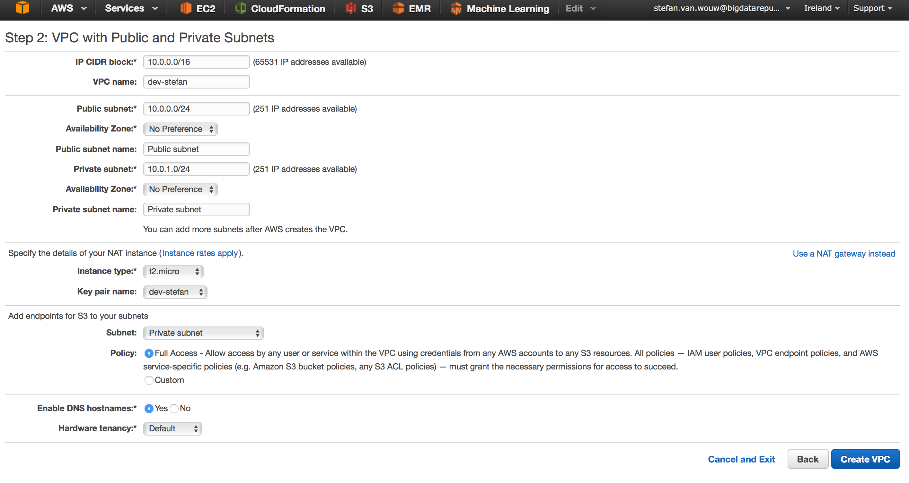
4. When the VPC is created, inspect various options. First filter by VPC, and select the VPC you just created.
    1. Inspect the "Subnets" tab, which should contain 2 subnets "Public subnet" and "Private subnet". By default each of the subnets does have the default Access Control List (ACL) firewall attached, which allows all inbound and outbound traffic. We are going to tighten the security later in the guide.
    2. Inspect the "Route Tables" tab, which should contain 2 route tables. Routing tables are used to route traffic between subnets, and from and/to The Internet. All AWS managed service APIs can only be accessed through The Internet, and not directly from within a private subnet. One exception is S3, which allows you to setup a dedicated VPC endpoint (we did this in previous steps). The public subnet is explicitly associated with the public routing table, and therefor can access the Internet, the S3 VPC endpoint, and local subnets in 10.0.0.0/16. The private subnet is associated with the private routing table, and therefor can access the S3 VPC endpoint, local subnets in 10.0.0.0/16, and all traffic to the internet goes through the NAT (eni-xxx).


#### Questions
Answers to the questions can be viewed on-click.

<details>
  <summary>1. Do instances in a private subnet have a public internet-routable IP ? </summary>
   No, they only have a private IP in the range associated with the subnet (in this case 10.0.1.0/24 , equaling to 10.0.1.4  to 10.0.1.254 ; .0 reserved for subnet network address , .1 reserved for VPC routing table / gateway, .2 reserved for DNS resolving, .3 reserved for AWS future use, .255 reserved for subnet broadcast).
</details>

<details>
  <summary>2. How many *private* IP addresses are available in the public subnet after taking the NAT instance into account?</summary>
   250, since the NAT takes up 1 private, and Amazon reserves 5 IPs by default (see answer to question 1).
</details>

<details>
  <summary>3. How many *public* IP addresses are available in the public subnet after taking the NAT instance into account?</summary>
   As many as needed. Public IP addresses are not reserved for any subnet. When assigning a public IP to an instance (in the public subnet), you will automatically get an IP address from the public IPv4 pool Amazon owns. If you want to assign a static public IP address, you can use Amazon's Elastic IP service, which allows you to lease public IPs even when you have not attached them to an instance.
</details>

<details>
  <summary>4. Which of these Amazon Managed Services require Internet access on instances in the private subnet, in order to be able to use them from these instances? S3, Route53 (managed DNS), SQS (simple queue service).</summary>
   It depends. If you have added an S3 region endpoint to your VPC routing tables, then S3 access to that specific region does not go over The Internet. Access to other S3 regions DOES go over The Internet (including the global endpoint!), so make sure to correctly configure the region your instances use. If you did not configure an S3 endpoint, then all traffic to S3 goes over The Internet. Route53 DNS management and SQS queue (and any other service besides S3) access always goes over The Internet. DNS lookup/resolving does not go over The Internet, because the third private IP address (.2) of each subnet is reserved for DNS lookup.
</details>


### Configure EMR

Now you have created your VPC with both a public and private subnet, we can start provisioning the Amazon EMR cluster.

1. From the AWS Console select "EMR", and press the "Create cluster" button. In addition, make sure to click the "Go to advanced options" link.
2. Configure the cluster with release "emr-4.7.2", and check at least "Hadoop 2.7.2" and "Spark 1.6.2". 
3. In the second step, select the VPC you created in the previous section. Select the *private* subnet. Select m4.large as instance type for all nodes. Because we are using the cluster for testing purposes, we can save a lot of money by using spot instances. Spot instances are the instances that are available for a reduced cost as long as there is an excess capacity of the instance type. Tick the box and enter a maximum price of $0.264 (normal on-demand price in eu-west-1) for the Master and Core instances. **Note that for production systems it is not recommended to use spot instances, because if the market price exceeds your bid, the instances will be terminated.** You generally use on-demand instances for Master and Core to keep a stable cluster, and you can use spot instances for Task nodes that provide extra capacity when running a large job, but do not necessarily need to be up. 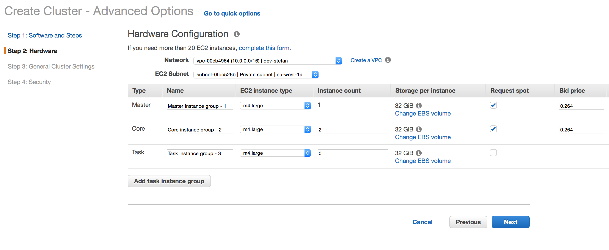
4. In the third step, keep the defaults (see picture below). 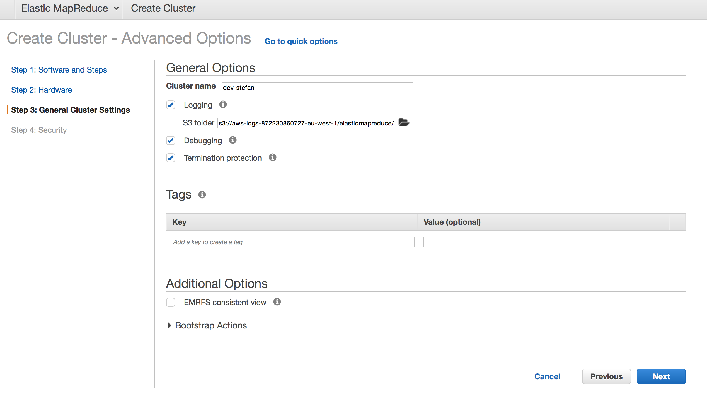
5. In the last step, select your EC2 key pair created at the beginning of this guide. This allows you to login with SSH to the cluster instances. Keep the permissions and security groups to the defaults for now, these set the AWS API access permissions for the EMR instances, and their instance specific firewalling respectively. Make sure to select "S3 server-side encryption", so all data that is being saved to S3 is encrypted on disk by default. 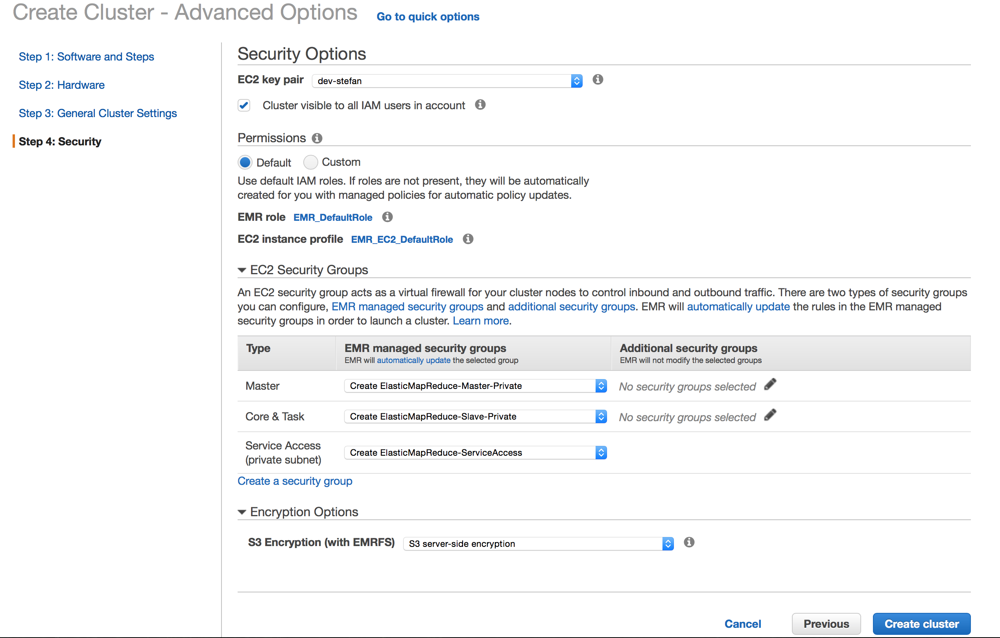

While the EMR cluster is getting provisioned, you can check the "EC2" page for "Running Instances". In a minute or two, 3 new instances should appear of type m4.large. You can inspect their private IPs and security groups to see in which subnet their are allocated, and what firewalling is configured by default.
In addition, you can find the details of your EMR cluster on the "EMR" page by selecting your dev-<name> cluster. When the status of the cluster becomes "Waiting", it is ready to receive jobs, and you can move on to the next section. In the mean time, you can answer the questions below.
#### Questions

<details>
  <summary>1. What security groups have been automatically created, and for what purpose? (hint: Check the "VPC"->"Security Groups" page after filtering on your VPC)</summary>
  In addition to the default security group that is assigned to instances which do not explicitly provide security groups, we have:<br>
  <b>ElasticMapReduce-Master-Private:</b> Security group for the Master instance of the cluster. Allows all outbound traffic, allows all inbound traffic from Core/Task instances, and allows TCP 8443 inbound from the EMR API controller for provisioning purposes.<br>
  <b>ElasticMapReduce-Slave-Private:</b> Security group for the Core/Task instances of the cluster. Allows all outbound traffic, allows all inbound traffic from Core/Task instances, and allows TCP 8443 inbound from the EMR API controller for provisioning purposes.<br>
  <b>ElasticMapReduce-ServiceAccess:</b> Security group for the Elastic Network Interface (ENI) of the EMR API controller that is provisioned out of user's control. Only allows outbound traffic to the Master/Core/Task nodes on port TCP 8443 for provisioning purposes.<br>
</details>

<details>
  <summary>2. Will we be able to access the EMR cluster through SSH with current configuration? What allows/prevents us from doing so?</summary>
  No. The EMR instances do not have public IP addresses attached. Even if they had (in theory), then we would still require an intermediate instance in the public subnet to route traffic to them, because instances in the private subnet cannot directly be reached from the Internet since no Internet Gateway is attached to the private routing table. If such a route would be in place (through a load balancer or software VPN), then it would still not be possible because although subnet ACLs do not impose any restrictions, the security groups of the instances do not allow port 22 TCP traffic from outside the cluster.
</details>

<details>
  <summary>3. Will we be able to access the EMR cluster through SSH with current configuration if we were already logged in on an instance in the public subnet (e.g. the NAT) ?</summary>
  No. Although public/private subnet ACLs do not impose any restrictions, the security groups of the instances do not allow port 22 TCP traffic from outside the cluster. In this case, even if you logged in into an instance in the private subnet other than one from the cluster, the security groups still prevent access.
</details>

<details>
  <summary>4. Check the EMR_DefaultRole and EMR_EC2_DefaultRole in "IAM"->"Roles". What purpose do these roles have in the EMR cluster? How would you limit access to a subset of S3 buckets to the EMR cluster instead of all buckets in the account (default) ?</summary>
    <b>EMR_DefaultRole:</b> Role used by the Elastic MapReduce managed service to provision EC2 instances, create log S3 buckets, and pass the EMR_EC2_DefaultRole's accompanying instance profile to the EC2 instances created.<br>
    <b>EMR_EC2_DefaultRole:</b> The policies attached to this role are used for giving the Master/Core/Task instances access to write their logs to cloudwatch, read and write to S3 (all buckets can be accessed by default), and access various other services. The Gotcha here is that Amazon uses Instance Profile and Role interchangeably in its documentation. An IAM Role cannot be attached to an instance directly, but requires an instance profile object that encapsulates the role. <br>
    You can only limit access to specific S3 buckets, by creating an alternative InstanceProfile+Role combination to the EMR_EC2_DefaultRole, and specify this in the EMR configuration. In the accompanying policies, you can specify a range of S3 buckets instead of all (default).
</details>


# Running an example job

There are two ways of running a job on an EMR cluster. Either you connect to the cluster REST API endpoint (YARN), which allows you to run interactive jobs using the Spark Shell from your own workstation for example. Another option is to use pre-compiled JAR files and submit them through the AWS EMR API and/or console.
In this step we explore the second option, since we do not have access to the cluster's REST API endpoint for YARN at this point. After the next section, we will also explore the YARN endpoint option.

1. Navigate to your EMR cluster's detail page.
2. Submit an example Spark job to compute PI using 10 parallel tasks, as shown in the picture below. Use "--class org.apache.spark.examples.SparkPi" as spark-submit options, and "/usr/lib/spark/lib/spark-examples.jar" as executable path. 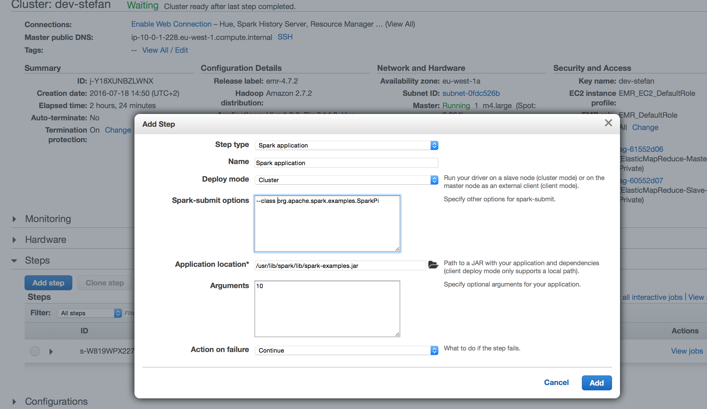
3. After the EMR step has been submitted it will run on the cluster. This EMR step feature is typically used to schedule batch jobs in production environments periodically. It however provides little feedback on what is going on. In order to see this, we will also explore other options of running jobs later in the guide.
4. (Optional) If you have a pre-compiled Spark application ready, try to run it on EMR using the Steps interface. You can upload the jar to S3, and select it as JAR location.

# Remote Access to the Cluster

In order to get more insights into what is going on during the run time of a job, and to allow for running jobs from your workstation, we will require remote access to the cluster. In this section, we will configure an OpenVPN instance to provide you VPN access to the EC2 instances in the cluster.

## Configuring the OpenVPN instance

1. Navigate to "EC2" and click "Launch Instance".
2. Select the OpenVPN Acces Server **Bring Your Own License** Amazon Machine Image (AMI), which includes 2 free connections suitable for testing purposes. 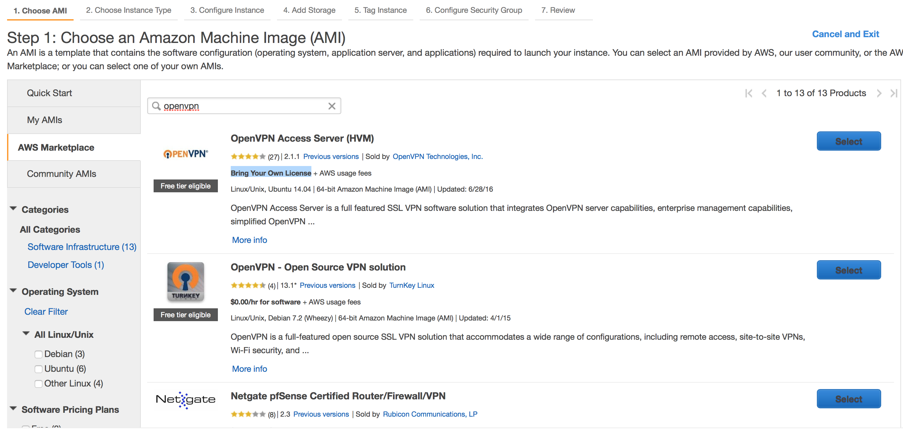
3. Select t2.micro as instance type. 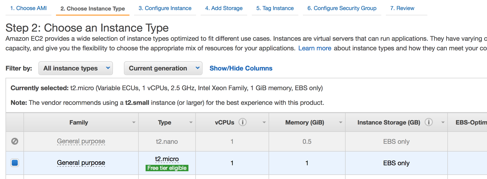
4. Select your VPC, the *public* subnet, enable auto-assign public IP, and check "Protect against accidental termination". 
5. On the same page, paste the following User Data. This automates the configuration of the OpenVPN access server on the instance. Make sure you include the last comment so the restart command also gets executed.
```bash
#!/bin/bash
admin_user=openvpn
reroute_gw=0
reroute_dns=1
apt-get update && apt-get install -y awscli,
/usr/local/openvpn_as/bin/ovpn-init --ec2 --batch
/bin/sleep 5 # Wait for OpenVPN Start
/usr/local/openvpn_as/scripts/sacli status
/usr/local/openvpn_as/scripts/sacli --key vpn.server.google_auth.enable --value true ConfigPut
/usr/local/openvpn_as/scripts/confdba -mk vpn.server.group_pool.0 -v 172.27.240.0/20 # Note: These are NAT-ed ip addresses (openvpnclient to openvpnserver communication), they are not claimed in our VPC
/usr/local/openvpn_as/scripts/confdba -mk vpn.daemon.0.client.netmask_bits -v 20
/usr/local/openvpn_as/scripts/confdba -mk vpn.daemon.0.client.network -v 172.27.224.0 # Note: These are NAT-ed ip addresses (openvpnclient to openvpnserver communication), they are not claimed in our VPC
/usr/local/openvpn_as/scripts/confdba -mk vpn.daemon.0.listen.ip_address -v all
/usr/local/openvpn_as/scripts/confdba -mk vpn.daemon.0.server.ip_address -v all
/usr/local/openvpn_as/scripts/confdba -mk cs.https.ip_address -v all
/usr/local/openvpn_as/scripts/confdba -mk admin_ui.https.ip_address -v all
/usr/local/openvpn_as/scripts/confdba -mk vpn.server.port_share.service -v client
echo "openvpn:*2016ManualEmrDeploymentRemoteAccess" | chpasswd
/etc/init.d/openvpnas restart
# A newline should be after the last line, thus this comment to enforce it.
```

6. Skip the "Add Storage" settings / keep the defaults.
7. Tag the instance with "OpenVPN-dev-<name>" with your name substituted for <name>. This makes it easier to find the instance in the instance list later on. 
8. Use the default security groups. 
9. Finally, create the instance, and select your key pair so you will be able to access it in case automatic configuration fails. 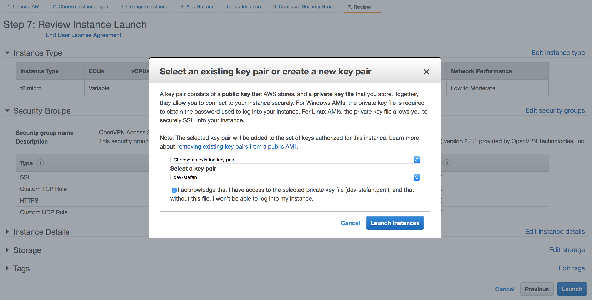
10. When the instance is correctly provisioned you can browse to https://<your_public_dns> , which can be retrieved by selecting your instance in "EC2"->"Instances" , and pressing the "Connect" button.

#### Troubleshooting

In case automatic provisioning fails, login to the instance using SSH with (or use PuTTY): ssh -i "<your key pair locally stored>" openvpnas@<your_public_dns>. If the instance is not provisioned fully you should get a configuration prompt of OpenVPN immediately. You can use the configuration as defined at the top of the user data script in there manually, or exit the script CTRL+C and then manually execute all the steps from the user data script like shown below.

## Connecting to your VPC using OpenVPN

1. Navigate to "https://your_public_dns" , and select "Login" from the dropdown box. Enter the credentials (openvpn ; *2016ManualEmrDeploymentRemoteAccess), and login.
2. Since it is the first time logging in you still have to configure Google Authenticator for 2FA. Scan the barcode with the app, and press "I have scanned the code".
3. After logging in again, download the OpenVPN Connect client application and install it on your machine.
4. Download the connection profile for yourself "Yourself (user-locked profile)".
5. In the client, select "Import"->"From local file", and select the .ovpn profile.
6. Then select "public ip/dns"->"Connect as openvpn", insert your credentials again, including the code on your Google Authenticator app.
7. When successfully connected, all DNS lookups are routed through the VPN connection. This means you should be able to resolve "nslookup ...internal DNS of your NAT...". In addition you should be able to traceroute/tracert ...internal ip of your NAT or OpenVPN instance.... If you execute ipconfig/ifconfig you should also see assigned a 172.27.224.0/20 IP to your workstation.

Note that it is perfectly possible to add multiple users to the OpenVPN server and each user having their own login credentials/profile. This would require a different AMI based on the number of users you expect, to conform to the OpenVPN license. Configuring multiple users is out of scope of this guide. This is, however, very easily done through an Admin UI (which we now disabled).


#### Questions


<details>
  <summary>1. When connected to your VPC using OpenVPN, will http:// connections be secure, or would you require https:// ?</summary>
  All traffic between your workstation and the VPC is encrypted by default, since OpenVPN uses SSL/TLS VPN. So even if you are using http:// to an instance in the VPC, the underlying connection is still encrypted.
</details>
<details>
  <summary>2. What IP address will appear in the server access logs of an instance when you connect to it using its private IP?</summary>
  The private IP of the OpenVPN instance 10.0.0.XXX. The way routing works is that the OpenVPN instance is dual-homed (both in 10.0.0.0/24 and 172.27.224.0/20), and it functions as a NAT from 172.27.224.0/20 to 10.0.0.0/16). The 172.27.224.0/20 IP address assigned to your machine is solely used to allow routing of traffic between your workstation and the OpenVPN instance. If multiple users are connected to the same OpenVPN instance, they all get a unique IP in the 172.27.224.0/20 range, but by default they will not be able to communicate with each other (this can be enabled). The 172.27.224.0/20 IP range is also not getting used within the VPC, so in theory you would be able to create subnets in the VPC using the same IP range as used by VPN clients.
</details>

<details>
  <summary>3. Will you be able to SSH to the instances in the EMR cluster?</summary>
  No. The ElasticMapReduce-Master-Private and ElasticMapReduce-Slave-Private security groups do not allow connections on port TCP 22. We will enable this in the next section.
</details>


## Enabling access to the EMR instances when using VPN
In this section we are going to allow the users that connect through OpenVPN to connect to both the native Hadoop YARN/Spark management interfaces, as well as connect to SSH, and submit jobs.
Because we are solely using security groups for firewalling (see note 2 for recommendations), we can suffice by providing access in the security groups for the Master/Core/Task instances only.


1. Create a new security group called ElasticMapReduce-Access by going to "VPC"->"Security Groups"->"Create Security Group" after filtering on your VPC. Any instance that is in this security group will be granted access to the cluster. 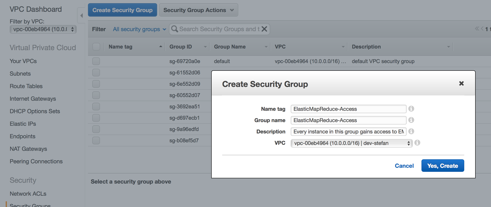
2. Add SSH access as well as TCP 8088 (YARN UI), 20888 (YARN APP PROXY), 18080 (YARN APP PROXY), 8020 (HDFS endpoint), 8032 (YARN app endpoint) to ElasticMapReduce-Master-Private, with Source the ElasticMapReduce-Access security group. 
3. Add SSH access as well as TCP 8042 (YARN UI), 50010 (HDFS endpoint) to ElasticMapReduce-Slave-Private, with Source the ElasticMapReduce-Access security group. 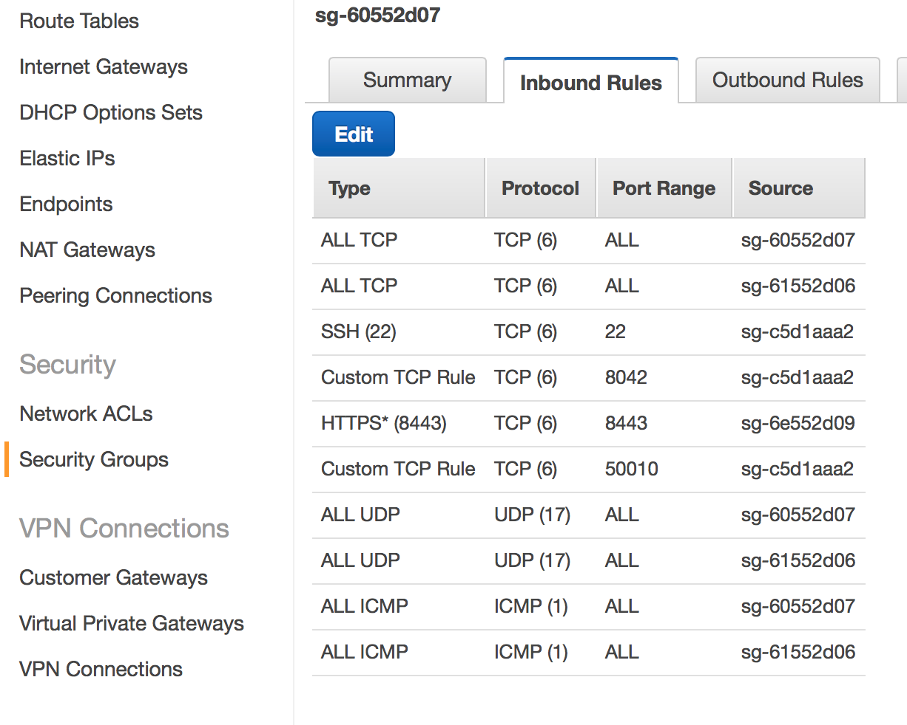
4. Go to "EC2"->"Instances", select your OpenVPN instance and select "Actions"->"Networking"->"Change Security Groups". Tick the ElasticMapReduce-Access group. Since all VPN traffic is NATed through the OpenVPN instance, firewalling/access for VPN users should be applied to the OpenVPN instance. 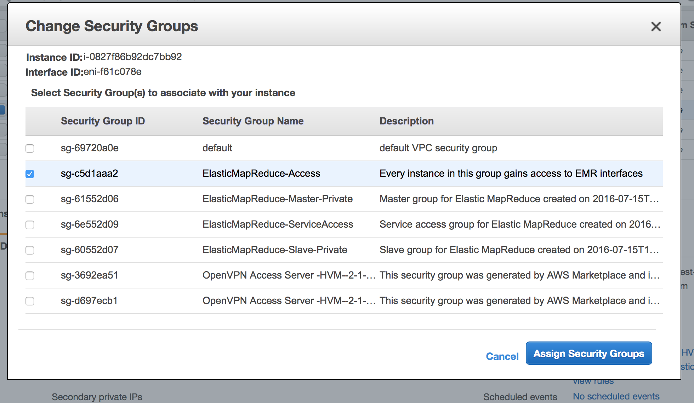
5. Check that you have access. http://your_master_instance_ip:8088 should show you the YARN Management page. You should be able to navigate and also inspect Nodes (which use TCP 8042 in the slave security group). 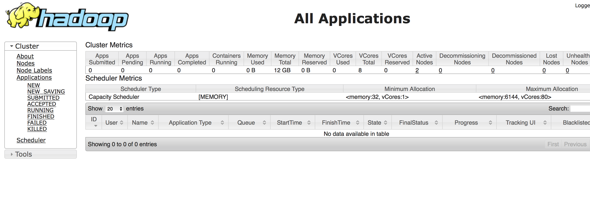
6. (Optional) When running a job through the EMR step interface it should also appear on the YARN management page. You can track progress by clicking on the job, which will redirect you to the Spark Application monitoring UI as long as the job is active.

**Note:** For data lakes storing highly confidential data, it is a good idea to not allow submission of jobs from the workstation and/or Spark shell access. A separate notebook server could be configured in the private subnet, which data scientists have to connect to in order to perform data science tasks on the data. This way, all data stays within the cluster and is only accessible through a notebook interface hosted in the same VPC itself.
**Note 2:** We only have configured security groups for firewalling. An additional security measure for production systems would be to configure the network ACLs as well. In addition, local OS-level firewalls could be configured for highly confidential data.

## Submitting a job on the cluster from your workstation

1. Make sure you have Spark installed locally by extracting it somewhere in a location you remember (+ install Java locally). http://d3kbcqa49mib13.cloudfront.net/spark-1.6.2-bin-hadoop2.6.tgz . We refer to the install location with SPARK_HOME (not to be confused with an environment variable).
2. In order to connect to the cluster, which is running in YARN mode, we will require the Hadoop configuration files from the cluster to be downloaded to the workstation. ``mkdir <SPARK_HOME>/yarn-conf && scp -i "your key pair" ec2-user@master_private_ip:/etc/hadoop/conf/* <SPARK_HOME>/yarn-conf/``
3. In order to submit a job, run the following: ``YARN_CONF_DIR=<SPARK_HOME>/yarn-conf/ HADOOP_USER_NAME=hadoop <SPARK_HOME>/bin/spark-submit --master yarn --deploy-mode cluster --class org.apache.spark.examples.SparkPi <SPARK_HOME>/lib/spark-examples-1.6.2-hadoop2.6.0.jar 10``.


## Spark Shell and Notebooks

Submitting a job from your workstation works with the current configuration. However, interactive use of the cluster such as spark-shell and/or notebooks requires bi-directional networking between your workstation and the cluster.
This is because the Spark worker nodes (executors) need to be able to connect to the master (driver). When submitting jobs the driver is running on the YARN cluster, but when using Spark interactively, it is running on your workstation.

With the current setup, we use NAT to route traffic from the workstation through the OpenVPN instance onto the cluster. This is a mono-directional way of networking where the cluster cannot instantiate a connection to the workstation. This is because the workstation's IP is not exposed nor routable from the cluster (only the OpenVPN instance IP is visible). To make interactive use of Spark work, the IP address of the workstation in the VPN network needs to be exposed and routable from the cluster.
In order to accomplish this, we have to enable advanced routing in the OpenVPN instance (expose workstation IP), and modify the private routing table (make workstation IP routable). Doing this has quite a big implication, namely that client IP ranges become part of the network. Depending on the exact use case scenario, it might sometimes be better to host a notebook server in the private subnet instead, to keep the network topology simple and controllable.

1. First of all we need to modify the OpenVPN EC2 network interface configuration such that it will be able to forward traffic. Go to "EC2"->"Instances", select the OpenVPN instance and **disable** source/dest check "Actions"->"Networking"->"Change Source/Dest. Check". 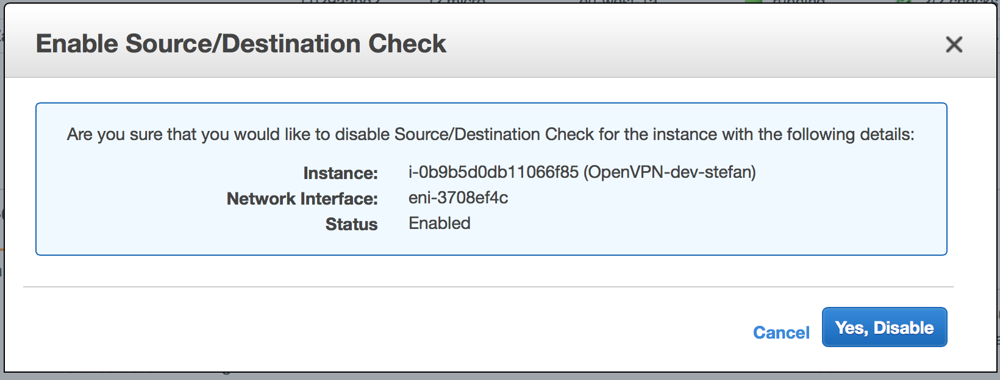
2. Allow traffic from the cluster to the vpn clients by modifying the OpenVPN auto-generated security group Inbound ("VPC"->"Security Groups" after filtering on your VPC). Add 10.0.0.0/16 as source. 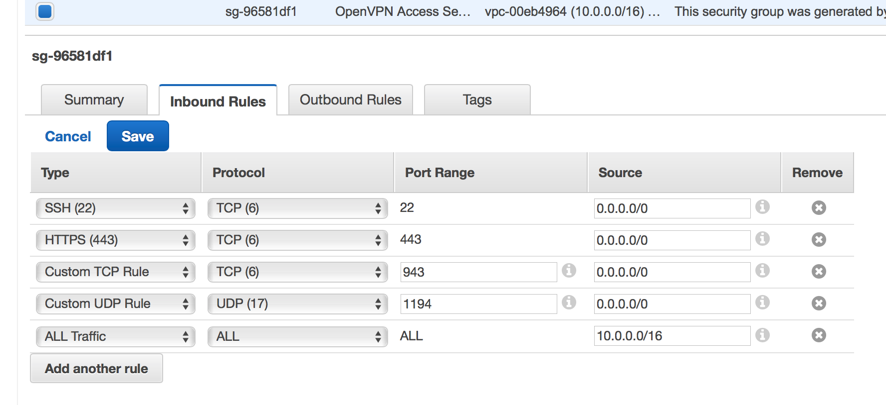
3. Make VPN clients routable in Private Routing table ("VPC"->"Routing Tables" after filtering on your VPC). Insert 172.27.224.0/20 as destination, and use the OpenVPN instance as target. 
4. Login to your OpenVPN instance using SSH ``ssh -i "your key pair" openvpnas@openvpn_public_ip``, and switch to root with ``sudo su -``.
5. Disable NAT / Enable advanced routing:
```bash
/usr/local/openvpn_as/scripts/confdba -mk vpn.server.routing.private_access -v route
/usr/local/openvpn_as/scripts/confdba -mk vpn.server.routing.allow_private_nets_to_clients -v true
/usr/local/openvpn_as/scripts/confdba -mk vpn.client.routing.reroute_dns -v custom
/usr/local/openvpn_as/scripts/confdba -mk vpn.server.dhcp_option.dns.0 -v <OpenVPN private IP e.g. 10.0.0.163>
/etc/init.d/openvpnas restart
```
6. For DNS forwarding to the internal AWS DNS to work using routing, we need to setup a small DNS forwarder on the OpenVPN instance. See http://mindfulmachines.io/blog/2015/11/26/setting-up-a-personal-vpn-to-access-aws-instances for background information on the WHY.
```
apt-get install -y bind9 bind9utils bind9-doc
```
7. Edit /etc/bind/named.conf.options to be the following:
```
acl goodclients {
0.0.0.0/0;
localhost;
localnets;
};
options {
directory "/var/cache/bind";
recursion yes;
allow-query { goodclients; };
forwarders {
10.0.0.2; # IP address of the DNS server in the public subnet
};
forward only;
dnssec-enable yes;
dnssec-validation yes;
auth-nxdomain no;# conform to RFC1035
listen-on-v6 { any; };
};
```
8. Now restart the DNS forwarder, after checking the syntax:
```
named-checkconf
service bind9 restart
```
9. Reconnect to the VPN if necessary. Then the following command should work:
```YARN_CONF_DIR=<SPARK_HOME>/yarn-conf/ HADOOP_USER_NAME=hadoop SPARK_PUBLIC_DNS=<your private ip on VPN> SPARK_LOCAL_IP=<your private ip on VPN e.g. 172.27.232.2> <SPARK_HOME>/bin/spark-shell --master yarn --deploy-mode client```


You can now work in the Spark shell and interactively query the cluster. You can monitor the Spark jobs getting launched at http://localhost:4040. You will also immediately encounter a downside to working remotely like this, the interactive shell takes a while to start, because everytime the whole 200MB Spark jar is uploaded over The Internet to HDFS in AWS. Using a notebook server that is hosted in the same data centre is preferred for data security, and bandwidth/data transfer cost reasons.

#### Questions
<details>
  <summary>1. With the new bi-directional routing setup, will instances in the public subnet be able to route to VPN clients?</summary>
  No, with OpenVPN being the exception. All traffic needs to be routed through the OpenVPN instance, but we only configured this route for the private subnet, not for the public subnet.
</details>
<details>
  <summary>2. Why do desperately want to route DNS traffic through the cluster?</summary>
  Otherwise, local DNS names that are resolvable in the cluster, are not resolvable on the workstation. Many actions depend on the DNS names (redirects of management consoles, and connection forwards in Spark-shell/submit).
</details>
<details>
  <summary>3. What would be the major downsides of using the cluster interactively like this?</summary>
  The whole 172.27.224.0/20 range is no longer usable in the cluster VPC. Although data-transfer into the cloud is free, data transfer to the outside world is not. By using your workstation as a Spark driver, more traffic is outbound from the cluster. Uploading jars from your workstation takes a long time, hogging the bandwidth of the entire on-premise network. Uploading to S3 once, and re-using is the better option, combined with hosting a notebook server in the cloud. By using a workstation as the driver, more data transfers out of the cluster than might be allowed to conform with security requirements.
</details>

# Open Exercises

In this guide we have configured an EMR cluster inside a VPC, and allowed remote access using OpenVPN.
Please find some additional open/optional exercises below. If you rather want to learn about how to automate the deployment, please visit the [Automatic EMR Deployment Guide](../2-automatic-emr-deployment/README.md).


#### Scaling up/down
During the guide we assumed we always have 2 Core nodes available to schedule job work on. It might be that you want to schedule more work at the same time, or have a very heavy job that requires more resources. You can experiment with adding/removing nodes to/from the cluster by going to "EMR", selecting your cluster and clicking "Resize". **Please make sure you do not create more than 2 additional nodes to prevent us from hitting the instance limit (terminated nodes keep counting to the limit for about 2 hours). Also please scale back to the original size if you no longer need it to reduce costs.**
#### Tightening Security with nACLs
The current setup has only 2 layers of security, namely the routing table and the security groups. We can add up to 4 layers of security by also enabling OS firewalling (iptables), and subnet layer firewalling using network access control lists (nACLs). OS level firewalling might only be useful for data lakes with very high confidential data, and is usually overkill. A best practice, however, is to use both security groups and nACLs by default.
In this exercise you will be tightening security by adding nACLs to both the public and private subnets. Whereas security groups firewall at the network interface level, nACLs firewall at the subnet level. Whereas security groups are stateful, nACLs are stateless. This means that you also need to open inbound [ephemeral ports](https://en.wikipedia.org/wiki/Ephemeral_port) on a subnet if you want outbound TCP traffic to be possible. A security group does not require this since it automatically allows traffic on inbound ephemeral ports if the connection was initiated from the interface the security group is attached to.


Use the following for extra guidance in setting up nACLs http://docs.aws.amazon.com/AmazonVPC/latest/UserGuide/VPC_ACLs.html
Suggested steps to take:
1. Add a "Public Subnet ACL" at "VPC"->"Network ACLs" (after filtering on your VPC). Associate it with the Public subnet.
2. Add a "Private Subnet ACL" at "VPC"->"Network ACLs" (after filtering on your VPC). Associate it with the Private subnet.
3. To have it less confusing, allow outbound traffic TCP by default on both subnet ACLs. The routing table takes care of outbound traffic only being able to travel through certain paths.
3. Open all TCP inbound on the public subnet from the private subnet to allow [ephemeral ports used by Linux and by Spark executor](http://docs.aws.amazon.com/AmazonVPC/latest/UserGuide/VPC_ACLs.html#VPC_ACLs_Ephemeral_Ports) , as well as internet access from the private subnet.
4. Open [ephemeral ports](http://docs.aws.amazon.com/AmazonVPC/latest/UserGuide/VPC_ACLs.html#VPC_ACLs_Ephemeral_Ports) TCP inbound on the private subnet to allow connections from the cluster to The Internet (0.0.0.0/0) and the VPN client drivers.
5. Open the same ports added to the security groups for YARN/HDFS etc. inbound private subnet with source the public subnet OR the 172.27.224.0/20 range. Which one would be required here? How does VPC routing/subnet acl work with the OpenVPN routing? Tricky networking starts here.
6. Make it work...even when you remove allowing all outbound TCP traffic.

#### Connecting a local Notebook
If you have a local Jupyter or Zeppelin notebook. Try to build a kernel that connects  to the cluster.

Suggested read: http://www.bigdatarepublic.nl/configuring-jupyter-for-pyspark-1-5-2-with-pyenvvirtualenv/
Combine this with the environment options and (py)spark-shell commandline arguments found in this guide.

# Wrap-up
When you are done with all activities we would like you to shutdown any resources you might have created.
To prevent unnecessary costs, please make sure that:

1. You terminate the EMR cluster.
2. You terminate the OpenVPN instance.
3. You terminate the NAT instance.
4. You remove the VPC.

